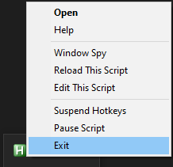

# Getting Started

## (Not) Installing AutoHotkey

For our purposes we'll use the portable version of AutoHotkey from [here](https://www.autohotkey.com/download/).
This will let you use AutoHotkey even on machines where you don't have admin access.

Download the AutoHotkey zip.


Create a new folder in your root directory and call it AutoHotkey so it looks like this `C:\AutoHotkey\`.
Extract the contents of your downloaded zip file there. 
This should now look something like this.


## Running scripts

Notice that we have three executable files. 
We care about `AutoHotkeyU64.exe`.
This is the AutoHotkey program.
Files with the extension `.ahk` are scripts that AutoHotkey recognises. 
Try dragging and dropping `WindowSpy.ahk` onto `AutoHotkeyU64.exe`.
Window Spy is a handy script provided with the AutoHotkey installation files. 
I had MS Paint open and `WindowSpy.ahk` detected the file name, class, exe, and PID of MS Paint. 
More on these later.


`Installer.ahk` is also a script with a GUI. 
It will install AutoHotkey for you if you like. 
`Template.ahk` is a template script. 
Had we installed AutoHotkey we would have been able to create a new script from the folder right click menu and we'd get a copy of `Template.ahk`
We will give up this convenience for portability. 


## Creating scripts

Create a new folder in your root directory and call it AHK so it looks like this `C:\AHK\`. 
We will store our scripts here. 
To create a script, copy `Template.ahk`, paste it in `C:\AHK\` and rename it to `MyScript.ahk`.
Opening it should prompt you to choose a default program. 
Choose to _Look for another app on this PC_ and navigate to `AutoHotkeyU64.exe`.
Remeber to tick _Always use this app to open .ahk files_ so that your computer remembers to open _.ahk_ files with AutoHotkey.


You will see the program running in the system tray (bottom right corner). 
For now exit the program. 
We'll create our own useful scripts soon enough. 



Go back to `C:\AHK\MyScript.ahk`, right click on it and choose to _Edit_ the file.
This should open it in Notepad. 
If you have a preferred text editor such as Notepad++, Sublime Text, Atom, or VS Code, you can use that.

Here we get some standard commands; we'll leave these as they are and keep them in our scripts for now. 


Here is the same text with syntax highlighting.

```ahk
#NoEnv  ; Recommended for performance and compatibility with future AutoHotkey releases.
; #Warn  ; Enable warnings to assist with detecting common errors.
SendMode Input  ; Recommended for new scripts due to its superior speed and reliability.
SetWorkingDir %A_ScriptDir%  ; Ensures a consistent starting directory.
```

## Next steps

At this point we have our files set up in an organised fashion. 
This will help us keep everything organised as we build various scripts as well as when making your own. 
