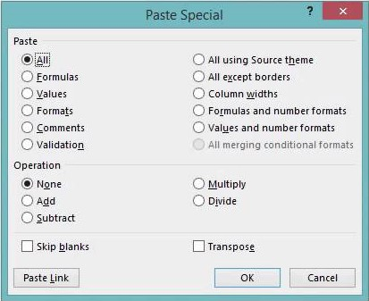

# Excel and VBA

## The pasting values problem

The function I wanted a shortcut for the most was for pasting only values (without formulas or formatting) in Excel.
My first attempt was to open the _Paste Special_ dialogue box, press the `V` key and `Enter`.



```ahk
#s:: Send, {AppsKey}ssv{Enter}
```

This didn't always work fine.
If I wasn't careful I would end up overwriting the contents of a cell. 
It would sometimes go unnoticed given how quickly the hotkey executes. 
I needed a more robust solution - Visual Basic.

## Hotkeys to execute VBA commands

If you know how to write in VBA then you can incorporate snippets in a hotkey.
This gave me a way to create hotkey for _paste values only_. 
All the while not needing to dive into the details of how VBA works.

```ahk
; Paste as values
#s:: ComObjActive("Excel.Application").Selection.PasteSpecial(-4163,-4142,"False","False")
;https://docs.microsoft.com/en-us/office/vba/api/excel.range.pastespecial

; Shift + mouse wheel to scroll sideways
+WheelDown:: ComObjActive("Excel.Application").ActiveWindow.SmallScroll(0,0,2,0)
+WheelUp::   ComObjActive("Excel.Application").ActiveWindow.SmallScroll(0,0,0,2)
```

An new issue turns up though. 
If I try any of the above hotkeys while typing in a cell, the entire AutoHotkey script errors out.
I get the option to reload the script from scratch or close it.
Thankfully, there is a solution to handling errors.

## The `Try` command

The [Try](https://www.autohotkey.com/docs/commands/Try.htm) command will guard from errors.
If you suspect a code chunk might error out, wrapping it with `Try` will prevent the error from blocking the rest of the script.
So now we can do

```ahk
; Paste as values
#s::Try ComObjActive("Excel.Application").Selection.PasteSpecial(-4163,-4142,"False","False")
;https://docs.microsoft.com/en-us/office/vba/api/excel.range.pastespecial

; Shift + mouse wheel to scroll sideways
+WheelDown:: Try ComObjActive("Excel.Application").ActiveWindow.SmallScroll(0,0,2,0)
+WheelUp::   Try ComObjActive("Excel.Application").ActiveWindow.SmallScroll(0,0,0,2)
```

Should an error be thrown, `Try` will guard from it and, for the above hotkeys, nothing happens.

## Hotkeys for Excel 

Finally, here is the full set of hotkeys for Excel 


```ahk
#IfWinActive ahk_exe EXCEL.EXE

; Find, paste, and search
F1::
Send ^f
WinWaitActive, Find and Replace, , 1
if ErrorLevel
{
    return
}
else
{
    Send ^v{Enter}
	return
}

; Moving through sheets
Pgdn::^Pgdn
Pgup::^Pgup

; Move through windows
MButton::
WinActivateBottom, ahk_class XLMAIN
return

; Shift + mouse wheel to scroll sideways
+WheelDown:: Try ComObjActive("Excel.Application").ActiveWindow.SmallScroll(0,0,2,0)
+WheelUp::   Try ComObjActive("Excel.Application").ActiveWindow.SmallScroll(0,0,0,2)

; Paste as values
#s::Try ComObjActive("Excel.Application").Selection.PasteSpecial(-4163,-4142,"False","False")
;https://docs.microsoft.com/en-us/office/vba/api/excel.range.pastespecial

; Paste as values and transpose
#+s::Try ComObjActive("Excel.Application").Selection.PasteSpecial(-4163,-4142,"False","True")

; Access clear content menu (in ribbon)
#w::Send, !he

; Clear all content
#e::Try ComObjActive("Excel.Application").ActiveCell.Clear

; Turn on Autofilter
#f::Send, ^+l

; Turn off filter
#a::Try ComObjActive("Excel.Application").ActiveSheet.AutoFilter.ShowAllData
```
