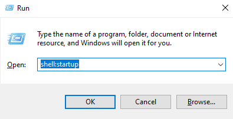

# Launching scripts at startup

Press `Win + R` to open the windows _Run_ program and type `shell:startup`.



This will launch the user's startup folder. 
Anything placed here is launched whenever the user logs in.
Create a blank text file and insert to following text. 
If you have placed your AutoHotkey files in a location different from the one recommended in the beginning of this tutorial then you will need to change the locations accordingly.

```bat
start "" "C:\AutoHotkey\AutoHotkeyU64.exe" "C:\AHK\MyScript.ahk"
```

Save the text file and rename the file to `Autostart script.bat`.
It is important to change the extension from `.txt` to `.bat`; this will turn it into an executable batch file.

> Warning: Be careful when making changes to scripts that launch at startup. 
Always be sure that these are free from bugs since having them launch at system startup might have undesirable effects.
